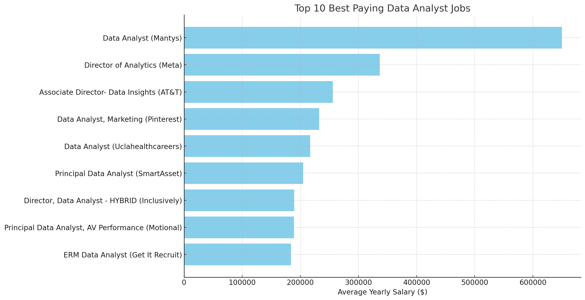

# Introduction
📊 Dive into the data job market! Focusing on data analyst roles, this project explores 💰 top-paying jobs, 🔥 in-demand skills, and 📈 where high demand meets high salary in data analytics.

🔍 SQL queries? Check them out here: [project_sql folder](/project_sql/)

# Background
Driven by a quest to navigate the data analyst job market more effectively, this project was born from a desire to pinpoint top-paid and in-demand skills, streamlining others work to find optimal jobs.

Data hails from [SQL Course](https://lukebarousse.com/sql). It's packed with insights on job titles, salaries, locations, and essential skills.

### The questions to answer through SQL queries were:
1. What are the top-paying data analyst jobs?
2. What skills are required for these top-paying jobs?
3. What skills are most in demand for data analysts?
4. Which skills are associated with higher salaries?
5. What are the most optimal skills to learn?

# Tools I Used
**Following the course**

For my deep dive into the data analyst job market, I harnessed the power of several key tools:

- **SQL**: The backbone of my analysis, allowing me to query the database and unearth critical insights.
- **PostgreSQL**: The chosen database management system, ideal for handling the job posting data.
- **Visual Studio Code**: My go-to for database management and executing SQL queries.
- **Git & GitHub**: Essential for version control and sharing my SQL scripts and analysis, ensuring collaboration and project tracking.

# The Analysis
**Only demonstrate Question 1**
### 1. Top Paying Data Analyst Jobs

```sql
SELECT
    job_id,
    name AS company_name,
    job_title,
    job_location,
    job_schedule_type,
    salary_year_avg,
    job_posted_date    
FROM
    job_postings_fact
LEFT JOIN company_dim ON job_postings_fact.company_id = company_dim.company_id
WHERE
    job_title_short = 'Data Analyst' AND
    job_location = 'Anywhere' AND
    salary_year_avg IS NOT NULL
ORDER BY
    salary_year_avg DESC
LIMIT 10
```
Here are three insights from the data:

- **Significant Salary Variability**:
The salaries for data analyst roles vary widely, from $184,000 to $650,000, indicating significant differences in role responsibilities, company value, and industry standards.
- **Senior Roles Command Higher Pay**:
Senior positions such as "Director of Analytics" and "Associate Director- Data Insights" generally offer higher salaries compared to standard data analyst roles, reflecting the increased responsibilities and expertise required.
- **Consistent Demand Across the Year**:
The job postings are spread throughout 2023, suggesting a steady demand for data analysts across different sectors, including tech, healthcare, and finance.


*Bar graph visualizing the salary for the top 10 best paying jobs for Data Analyst; ChatGPT generated this graph from my SQL query results*

# What I Learned
TBC

# Conclusions
1. The salaries for data analyst roles vary widely, from $184,000 to $650,000.
2. The job postings are spread throughout 2023, suggesting a steady demand for data analysts across different sectors, including tech, healthcare, and finance.

### Closing Thoughts
Good course!